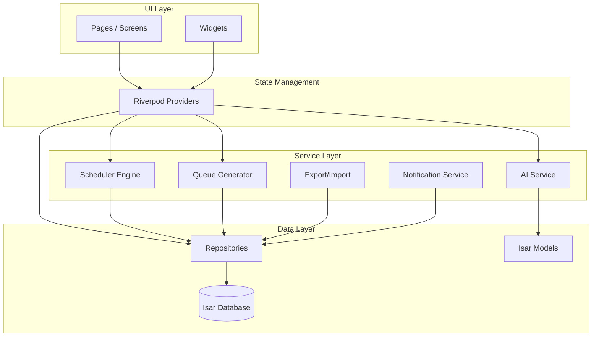

# MemFlow 技术选型与架构说明 v1.0

## 1. 文档目的
定义 MemFlow 移动端应用的技术栈、整体架构、模块职责与核心设计决策，作为开发团队统一认知与后续编码的基石。

## 2. 整体技术栈

| 层 | 技术选型 | 版本 | 理由 |
|---|---------|------|------|
| 框架 | Flutter | 3.24+ | 跨平台 (iOS/Android) 高性能渲染，一套代码覆盖双端 |
| 语言 | Dart | 3.5+ | 与 Flutter 原生集成，支持 AOT 编译，高效 |
| 状态管理 | Riverpod | 2.5+ | 编译安全、易测试、支持复杂异步场景 |
| 本地数据库 | Isar | 4.0+ | 高性能 NoSQL，支持索引、查询、嵌入式对象，适合离线优先 |
| 安全存储 | flutter_secure_storage | 9.2+ | 存储 LLM API Key 等敏感信息至系统 Keychain/KeyStore |
| Markdown 渲染 | flutter_markdown | 0.7+ | 支持代码块高亮、自定义样式 |
| 语法高亮 | highlight | 0.7+ | 与 flutter_markdown 集成 |
| 图表 | fl_chart | 0.68+ | 绘制统计图表（学习趋势、饼图） |
| 本地通知 | flutter_local_notifications | 17.2+ | 定时复习提醒 |
| 文件操作 | path_provider, file_picker, share_plus | - | 导入导出 JSON 卡组 |
| HTTP 客户端 | dio | 5.4+ | 调用 LLM API，支持拦截器、超时控制 |
| 代码生成 | build_runner, isar_generator | - | 为 Isar 模型生成代码 |
| 测试 | flutter_test, mocktail | - | 单元测试、Widget 测试 |

## 3. 架构全景图



**数据流动原则**：
- UI 仅通过 Provider 获取状态，不直接访问数据库或服务。
- Provider 调用 Service 或 Repository，处理业务逻辑。
- Service 层包含核心算法 (SM-2)、AI 通信、导入导出等无 UI 依赖的纯逻辑。
- Repository 封装 Isar 的 CRUD，提供简洁接口。

## 4. 模块详细说明

### 4.1 数据层 (Data Layer)
- **Isar 模型**：`Deck`, `Card`, `ReviewState`, `AIUsageLog`, `UserSettings`（见 Schema 文档）。
- **Repository**：
  - `DeckRepo`：增删改查卡组，级联删除卡片及复习状态。
  - `CardRepo`：卡片 CRUD，批量操作。
  - `ReviewRepo`：获取待复习卡片 (`due <= now`)，保存评分更新状态。
  - `SettingsRepo`：读写用户设置单例记录。
- **Isar 初始化**：在 `main.dart` 中通过 `Isar.open()` 开启实例，传入 Provider。

### 4.2 服务层 (Service Layer)
- **Scheduler (SM-2 Engine)**  
  纯 Dart 类，输入 `ReviewState` 和评分 `rating`，输出更新后的 `ReviewState`（含新 EF、间隔、due）。无状态，可单元测试。
- **Queue Generator**  
  负责每日复习队列组装：从 `ReviewRepo` 取到期卡片，从 `CardRepo` 取未学新卡片，按指定比例交错排列，支持面试倒计时权重排序。
- **Interview Planner**  
  根据用户设定面试日期、日均可投入时间、卡组优先级，计算每日建议新卡量和预期完成度。
- **AI Service**  
  封装 HTTP 调用 LLM API：支持 OpenAI、DeepSeek 及任何兼容的自定义端点。提供方法：
  - `generateCards(text, customPrompt?)` → `List<CardPreview>`
  - `explain(selectedText, contextCard)` → `String`
- **Export/Import Service**  
  将卡组及其卡片序列化为 `.mfcard.json` 格式；解析并导入 JSON 文件，重新生成 ID 插入库。
- **Notification Service**  
  初始化本地通知插件，根据 `UserSettings.reviewReminderTimes` 定时显示通知。

### 4.3 状态管理层 (State Management)
基于 Riverpod 的组织方式：
- **`reviewProvider`** (`StateNotifier`)：管理当前复习队列、当前卡片索引、是否完成。
- **`deckListProvider`** (`FutureProvider`)：卡组列表。
- **`cardsOfDeckProvider(deckId)`** (`FutureProvider.family`)：指定卡组的卡片列表。
- **`aiGenerateProvider`** (`StateNotifier`)：AI 制卡的文本输入、生成状态、预览卡片列表。
- **`statsProvider`** (`FutureProvider`)：统计数据。
- **`settingsProvider`** (`Notifier`)：用户设置读写。
所有 Provider 通过 `ref.watch` / `ref.read` 相互依赖，确保响应式更新。

### 4.4 UI 层 (UI Layer)
采用 Feature-first 目录结构（见代码结构）。每个功能（复习、卡组、AI生成、统计、设置）包含：
- `xxx_screen.dart`：页面脚手架
- `widgets/`：该功能专属组件
- `xxx_provider.dart`：该功能的状态提供者

主要页面组件树已在交互原型文档中描述。

## 5. 关键设计决策

| 决策 | 选择 | 理由 |
|------|------|------|
| 离线优先 | 本地 Isar 数据库为主，无后端 | 用户数据隐私，无需注册，可用作完全离线记忆工具 |
| AI 调用由客户端直连 | 用户自行提供 API Key | 避免服务器中转成本与隐私风险，降低项目维护负担 |
| SM-2 改良算法 | 在 SM-2 基础上增加 EF 下限保护、阶梯间隔、面试模式权重调整 | 保持简单有效，易于社区贡献新算法 |
| 状态管理用 Riverpod | 替代 BLoC | 模板代码少，测试友好，适合中型项目 |
| 卡片导入导出用 JSON | 标准格式 `.mfcard.json` | 便于版本控制、社区共享、跨工具互操作 |
| 不支持实时协作/云同步 | MVP 阶段不实现 | 聚焦核心复习体验，后续可通过文件同步解决 |

## 6. 性能与安全

- **性能**：
  - 复习队列一次生成后缓存内存，当天不再查询。
  - Isar 使用异步事务 (`writeTxn`)，避免阻塞主线程。
  - 卡片列表使用 `ListView.builder` 懒加载。
- **安全**：
  - API Key 使用 `flutter_secure_storage` 存储在系统加密区域。
  - 所有用户数据在本地明文存储，但 Android/iOS 沙盒已提供隔离。
  - 导出文件不含复习记录，保护隐私。

## 7. 测试策略

- **单元测试**：Scheduler、Queue Generator、AI Service 的 Mock 测试。
- **Widget 测试**：复习页面评分交互、AI 弹窗显示。
- **集成测试**：完整复习流程、卡组导入导出流程。
- 使用 `mocktail` 模拟 Isar 实例和 AI 响应。

## 8. 持续集成与交付

- GitHub Actions 配置：
  - `flutter analyze` 静态检查
  - `flutter test` 运行全部测试
  - 合并到 `main` 分支时自动构建 APK/iOS 包（待上架配置）
- 版本号遵循 `major.minor.patch` 语义化版本。

## 9. 项目代码结构

```
memflow/
├── android/
├── ios/
├── lib/
│   ├── main.dart
│   ├── app.dart
│   ├── core/
│   │   ├── theme.dart
│   │   ├── constants.dart
│   │   └── utils.dart
│   ├── data/
│   │   ├── isar_service.dart
│   │   ├── models/ (isar generated)
│   │   └── repositories/
│   ├── engine/
│   │   ├── scheduler.dart
│   │   ├── queue_generator.dart
│   │   └── interview_planner.dart
│   ├── services/
│   │   ├── ai_service.dart
│   │   ├── export_service.dart
│   │   └── notification_service.dart
│   ├── features/
│   │   ├── review/
│   │   ├── decks/
│   │   ├── ai_generate/
│   │   ├── stats/
│   │   └── settings/
│   └── widgets/
└── test/
```

---

**下一步**：可基于此架构开始搭建 Flutter 工程，编写基础 Provider 和 Repository 层。需要我给出**项目初始化步骤与依赖配置**吗？